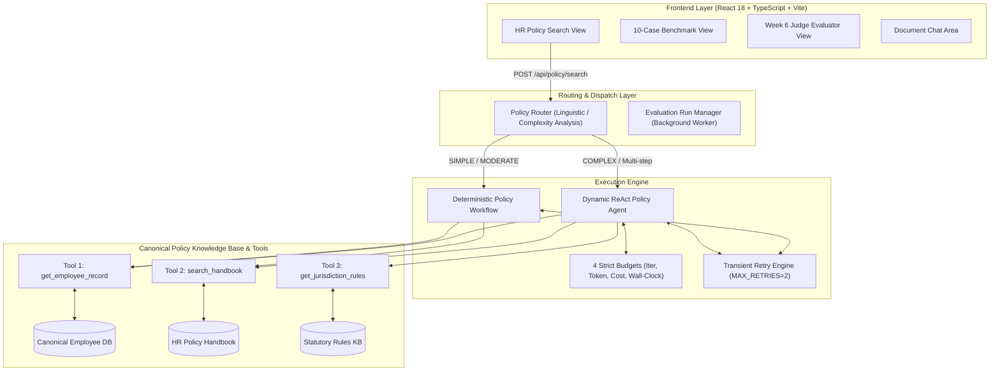
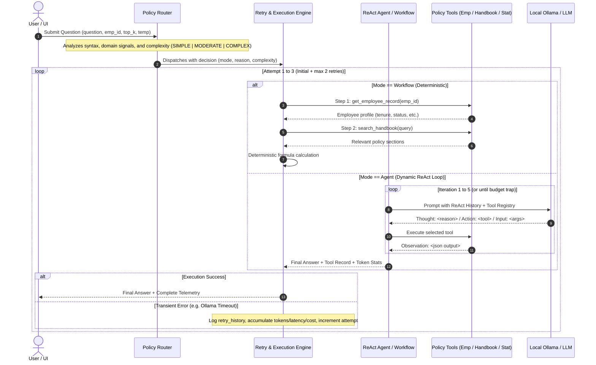
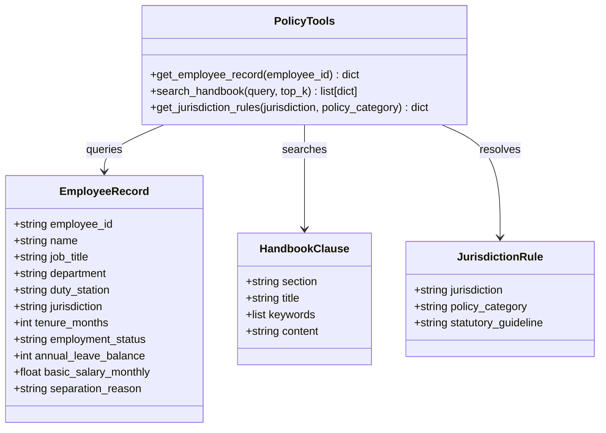
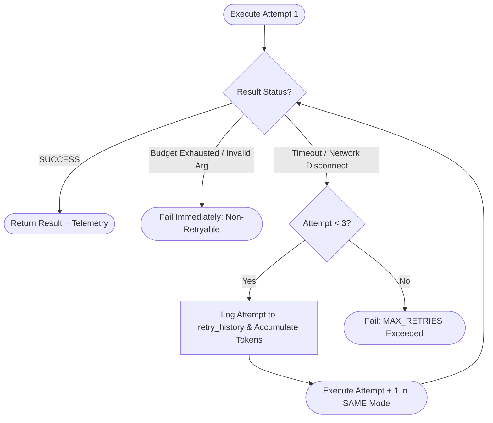

# HR Policy Assistant & Evaluation — End-to-End Workflow Architecture

This document provides a comprehensive technical reference for the **Week 6 (RAG & Judge Evaluation)** and **Week 7 (HR Policy Search, Routing & ReAct Agent Loops)** subsystems.

---

## 1. High-Level System Architecture

The application has two distinct and isolated operational modes:
1. **Week 6: Evaluation & Judge Benchmark Suite**: Evaluates document retrieval quality and generation accuracy using deterministic assertions and calibrated LLM judges (V1/V2) against a frozen 25-case benchmark dataset.
2. **Week 7: Production HR Policy Search with Automatic Routing**: A dynamic enterprise HR assistant that routes questions between a fast, deterministic **Workflow Mode** and an iterative **ReAct Agent Mode**, enforcing 4 strict resource budgets and resilient retry logic.



---

## 2. Policy Search Runtime Flow (Week 7)

When a user submits an HR policy query (e.g. *"What is Sarah Mwangi's annual leave accrual rate?"* or *"Compare statutory minimum sick leave in Kenya versus company policy for EMP005"*):



---

## 3. Policy Router Decision Logic

The router uses **structural linguistic signals** and domain dependency heuristics to determine execution complexity without requiring an expensive extra LLM call:

| Mode | Complexity | Decision Criteria | Example Queries |
| :--- | :--- | :--- | :--- |
| **Normal Workflow** | `SIMPLE` | Single-parameter policy lookup, deterministic single path. | *"What is the standard annual leave entitlement for EMP001?"*, *"How many days can EMP002 carry forward?"* |
| **Normal Workflow** | `MODERATE` | Two-step deterministic formula (Status check + rule lookup). | *"What notice must EMP003 provide if resigning on probation?"*, *"What severance pay is EMP007 entitled to for redundancy?"* |
| **Agent Mode** | `COMPLEX` | Cross-statutory comparisons, policy overrides, or conditional branching where the next tool depends on prior tool outputs. | *"Compare the statutory minimum sick leave in Kenya vs organisational policy for EMP005"*, *"Which jurisdiction rules override company policy for EMP006?"* |

---

## 4. The 3 Non-Overlapping Policy Tools

The system provides three tools with explicit, non-overlapping boundaries:



1. **`get_employee_record`**:
   - Accesses verified canonical employee records (`EMP001` to `EMP010`).
   - Retrieves: employment status (Probation vs Confirmed), tenure in months, jurisdiction duty station, leave balance, monthly basic salary, and separation ground.
2. **`search_handbook`**:
   - Performs semantic and keyword search across verified sections of the Organizational HR Policy Manual (`HRPolicy.pdf` / Section 5.2, 5.3, 10.1, 10.5, 10.7, etc.).
3. **`get_jurisdiction_rules`**:
   - Retrieves statutory minimum standards and labor frameworks for duty stations (Kenya, Ireland, Côte d'Ivoire, Rwanda, and Global baseline).

---

## 5. The 4 Strict Budgets

To protect against runaway loops, infinite tool cycling, and cost overruns, every Agent execution is governed by 4 deterministic budget constraints:

| Budget Name | Threshold | Description | Termination Code |
| :--- | :--- | :--- | :--- |
| **Max Iterations** | `5` | Maximum ReAct observation cycles. | `BUDGET_ITERATIONS` |
| **Max Tokens** | `4,000` | Cumulative prompt + completion tokens. | `BUDGET_TOKENS` |
| **Max Cost** | `$0.05` | Max USD estimated cost (evaluated at `$2.00 / 1M` tokens). | `BUDGET_COST` |
| **Max Wall-Clock** | `30.0s` | Maximum execution time before safety timeout. | `BUDGET_WALL_CLOCK` |

---

## 6. Transient Retry Engine Contract



- **Max Retries**: `MAX_RETRIES = 2` (Allows up to 3 total attempts: Initial + 2 retries).
- **Mode Invariance**: Agent retries as **Agent**; Workflow retries as **Workflow**. The mode never mutates mid-retry.
- **Retry Accumulation**: All latency, prompt tokens, completion tokens, and dollar costs accumulate monotonically into the final response contract.
- **Classification**:
  - **Retryable**: `OLLAMA_TIMEOUT`, `OLLAMA_UNAVAILABLE`, `TRANSIENT_NETWORK`, `PROVIDER_TRANSIENT`, `MODEL_ERROR`.
  - **Non-Retryable**: `BUDGET_ITERATIONS`, `BUDGET_TOKENS`, `BUDGET_COST`, `BUDGET_WALL_CLOCK`, `INVALID_EMPLOYEE`.

---

## 7. Week 6 Evaluation vs Week 7 Policy Execution Pipelines

The system maintains strict isolation between evaluation types to ensure evaluation metrics and benchmark datasets remain uncorrupted:

```text
┌────────────────────────────────────────────────────────────────────────┐
│                        RAG APPLICATION BACKEND                         │
├───────────────────────────────────┬────────────────────────────────────┤
│              WEEK 6               │               WEEK 7               │
│     RAG & JUDGE EVALUATION        │        PRODUCTION POLICY SEARCH    │
├───────────────────────────────────┼────────────────────────────────────┤
│ • Dataset: 25 Frozen Cases        │ • Dataset: 10 Benchmark Profiles   │
│ • Deterministic Assertions (5)    │ • Dynamic ReAct Agent Loops        │
│ • LLM Judges (Judge V1 / V2)      │ • Deterministic Policy Workflow    │
│ • Metrics: HitRate, MRR, Recall   │ • Automated Linguistic Routing     │
│ • Blind Human Label Validation    │ • 4 Strict Resource Budgets        │
│ • Root-Cause Error Taxonomy       │ • Real Telemetry (Tokens, Latency) │
│ • evaluation_type:                │ • evaluation_type:                 │
│   "WEEK6_RETRIEVAL_ASSERTION"     │   "WEEK7_POLICY_EXECUTION"         │
└───────────────────────────────────┴────────────────────────────────────┘
```

---

## 8. Real Telemetry & Provenance Guarantees

The system **never fabricates metrics**. Every field returned in the API and rendered in the UI represents real execution accounting:

- **Tokens**: Recorded from live Ollama response headers (`prompt_eval_count` and `eval_count`). When offline/mocked, explicitly labeled with `token_source: "proxy_estimate"`.
- **Latency**: Measured via high-resolution monotonic timer `time.perf_counter()` from request receipt to final output serialization.
- **Estimated Cost**: Calculated from total accumulated tokens at the single-source-of-truth rate `$2.00 / 1,000,000` tokens (`TOKEN_COST_PROXY_RATE = 0.000002`).
- **Provider Cost**: Labeled `"N/A"` for local Ollama execution to accurately distinguish hardware compute from commercial API billing.
- **Run ID**: Unique UUID generated per execution for end-to-end tracing and auditing.
