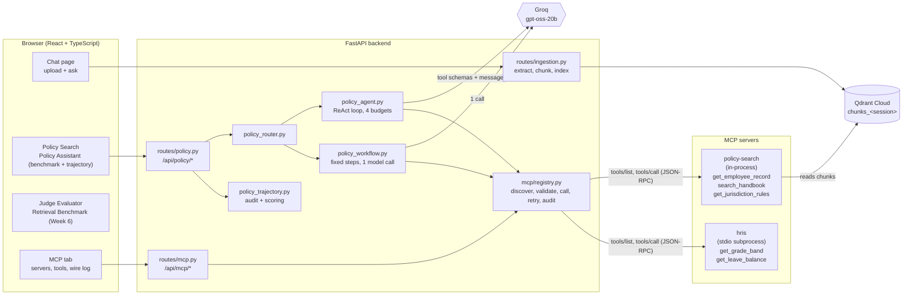
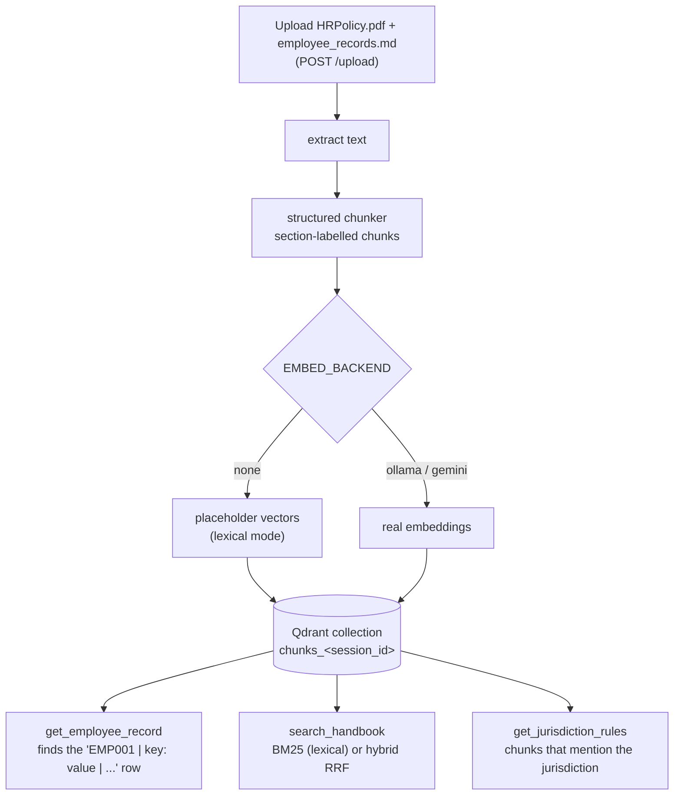
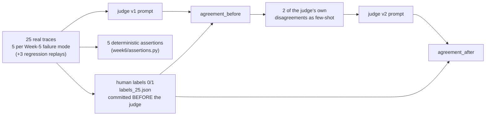
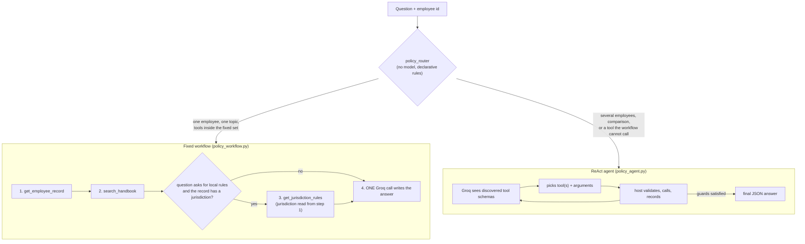
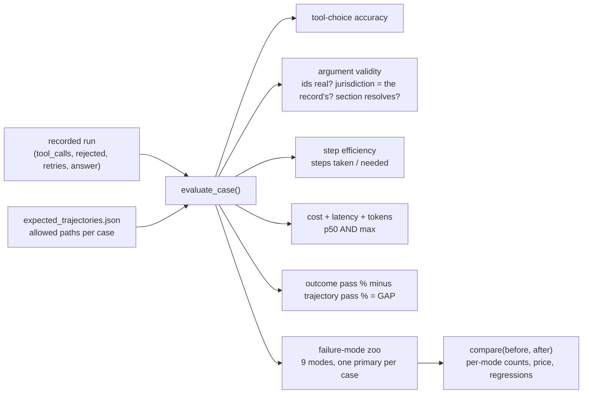
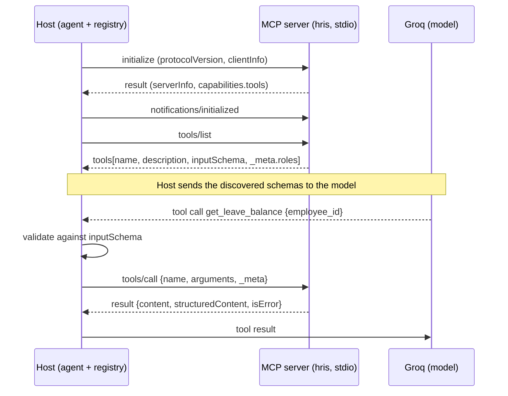

# Architecture and workflow: Weeks 6 to 9

One page to explain how the whole system fits together, then one section per week
that says **what it is, how it flows, where the code lives, how to see it live, and
what is honestly still open**.

- [1. The picture](#1-the-picture)
- [2. The one rule: tools read only what you uploaded](#2-the-one-rule-tools-read-only-what-you-uploaded)
- [3. Week 6: can you trust the judge?](#3-week-6-can-you-trust-the-judge)
- [4. Week 7: agent or fixed workflow?](#4-week-7-agent-or-fixed-workflow)
- [5. Week 8: scoring the path, not just the answer](#5-week-8-scoring-the-path-not-just-the-answer)
- [6. Week 9: MCP, adding a tool server with config only](#6-week-9-mcp-adding-a-tool-server-with-config-only)
- [7. Failures and retries: four layers](#7-failures-and-retries-four-layers)
- [8. Anatomy of one response (the JSON trace)](#8-anatomy-of-one-response-the-json-trace)
- [9. File map](#9-file-map)
- [10. Live demo script](#10-live-demo-script)
- [11. Data ownership and lifecycle](#11-data-ownership-and-lifecycle)
- [12. Open issues](#12-open-issues)

---

## 1. The picture



What to say in one breath: *a user uploads the handbook and an employee roster; both are
chunked into Qdrant for their browser session. A question is routed to either a fixed
three-step workflow or a Groq-driven agent. Both reach their tools through an MCP host
that discovers tools from servers listed in a config file, validates every argument
against the discovered schema, retries transient failures, and writes every call into
the JSON trace. Nothing the tools return is built into the code.*

---

## 2. The one rule: tools read only what you uploaded

The first prototype had the handbook, the employee table and country rules typed into
Python (`HANDBOOK_CLAUSES`, `CANONICAL_EMPLOYEES`, `JURISDICTION_RULES`). That was
removed. Now:



| Tool question | Source | If the documents are silent |
| --- | --- | --- |
| Who is EMP003? | the roster row in the uploaded chunks | `EMPLOYEE_NOT_FOUND` (recoverable) |
| What does the handbook say? | handbook chunks, ranked | empty result (`no_match`), the model must say so |
| What are Ireland's rules? | chunks mentioning Ireland | `NO_EVIDENCE` with a hint to use `search_handbook` |
| Is that section number real? | headings in the chunks **and** the uploaded file | flagged `unresolved` in `citation` |

Only *taxonomy* is static data (`backend/data/policy_taxonomy.json`: which jurisdictions
and categories a tool accepts, and search hint words). It selects what to look for and
never supplies an answer. The sample roster and sample HRIS extract in
`backend/data/samples/` are **fixtures you upload or point the stand-in HRIS at**, not
code.

**Lexical mode (`EMBED_BACKEND=none`).** Groq has no embeddings API, so a Groq-only setup
cannot produce vectors. Lexical mode stores chunks in Qdrant with constant placeholder
vectors and searches them with BM25; chat and the policy tools still call Groq.
`GET /api/policy/readiness` reports the mode that is really in effect. If you later
enable Ollama/Gemini embeddings, query embedding has an 8 s timeout and a 60 s
circuit-breaker so a dead embedding service costs one fast failure, then keyword search.

---

## 3. Week 6: can you trust the judge?

**Goal.** An LLM judge produces the correctness number. Prove it agrees with a human, or
find out it does not, and move the agreement figure with evidence.



| Piece | File |
| --- | --- |
| 25 cases, each tagged with a taxonomy mode | `week6/eval_cases_25.json` |
| Human labels, written first | `week6/labels_25.json` |
| 5 assertions (section present / resolves, version cited, numeric value, out-of-jurisdiction refusal) and the judged-criteria count | `week6/assertions.py` (count is now **computed**, not typed) |
| Judge prompts v1 / v2, prediction | `week6/judge_v1.txt`, `judge_v2.txt`, `prediction.txt` |
| One command | `python week6/eval_week6.py` (live Groq judge by default) |
| Backend / UI | `backend/routes/evaluation.py`, `backend/services/evaluation_runner.py` -> **Judge Evaluator** tab |
| Questions to import | `docs/questions/week6_judge_eval_25_cases.txt` |

**Honest status** (full list: [`training/week6/README.md`](training/week6/README.md))

- The blind protocol holds: labels were committed 2026-09-06 22:32, the judge ran at 00:01 next day.
- There is **no trustworthy before/after number yet**. The recorded files disagree
  (68% -> 28% in the saved outputs, 56% -> 100% from an offline rule stand-in, a 100% that
  mixes LLM and rule verdicts). Most "disagreements" in the 68% run are timeouts coerced to 0.
  Needed: one complete, fail-closed live rerun of v1 and v2 with frozen prompts.
- `case_16` (retirement age) is labelled a *correct refusal*, but the handbook states it
  (Section 10.3, 65th birthday). The label is disputed; it was **not** edited because
  relabelling after the fact would break the blind protocol.
- Bug fixes made during this pass: stale `ensure_frontend_built` tests, an unguarded manifest
  save during upload rollback (turned a clean error into a 500), flaky lifecycle tests.

---

## 4. Week 7: agent or fixed workflow?

**Decision rule.** *Does the path vary by input?* If the same tools run in the same order
for every input, a fixed workflow is cheaper, faster and auditable. If the next tool
depends on what a previous tool returned, the agent earns its cost.



**Same contract for both.** `PolicyOutputContract` with the same trace fields, the same
tools (through the same MCP registry), the same model, the same scorer, so the race compares
like with like.

**Tools (server one, prompt-style descriptions, one job each)**

| Tool | One job | Parameters |
| --- | --- | --- |
| `get_employee_record` | read one employee's row | `employee_id` (pattern-checked) |
| `search_handbook` | find policy passages | `query`, `top_k` (1..20) |
| `get_jurisdiction_rules` | passages for ONE jurisdiction + category | `jurisdiction` **enum**, `policy_category` **enum** (from the taxonomy file) |

Each description says what the tool does, when to call it, and **when not to** (so
`search_handbook` and `get_jurisdiction_rules` do not overlap), and how to read an empty
result.

**Four budgets, all enforced in the loop** (`schemas/policy.py`, env-overridable, hard
ceilings a request may lower but never raise): iterations (6), tokens (24 000), cost proxy
($0.05), wall clock (60 s). A budget stop is a clean `BUDGET_*` termination, never retried.

**Guards are generic, not tool-name based.** Servers tag tools with roles
(`employee_lookup`, `evidence`). A final answer is accepted only after both roles were
satisfied; asking for another employee's record is rejected. That is why the agent needed no
change when the HRIS tools appeared.

**Scoring** (`policy_scoring.py`, shared by agent, workflow and Week 8):
`passed` uses normalised matching ("One (1) week (7 calendar days)" satisfies `1 week`),
per-case aliases, **headline criteria** (the headline number must be in `entitlement_value`,
so a quoted rule cannot mask a wrong conclusion) and **forbidden phrases** (outside knowledge
such as a statutory figure the documents never state). The old literal check is kept as
`strict_passed` so history stays comparable.

**Live.** Policy Search (auto-routed, full trace) and Policy Assistant -> Benchmark (suite
`canonical` / `branching` / `all`, progress, cancel, p50 **and** max latency and cost).
Questions: `docs/questions/week7_agent_vs_workflow_questions.txt`.

**One live observation** (same question, same uploaded documents, Groq `gpt-oss-20b`):
probation notice for EMP003. Workflow 1 170 tokens, 2 tool calls, 1 model call;
agent 4 914 tokens, 2 tool calls, 3 model calls (it re-sends the growing history each lap).
Both answered "one week written notice" and cited 10.1. Numbers for all cases come from a
benchmark run; see [`training/week7/README.md`](training/week7/README.md).

---

## 5. Week 8: scoring the path, not just the answer

**Problem.** An agent can give the right notice period **without reading the employee's
tenure** (it guessed the common case). That passes the outcome eval and is a time bomb. So
score the trajectory and expose the gap as a number.



- **Alternate paths are data.** A case lists every valid order (e.g. `[E,S]` and `[S,E]`); a run passes
  if it matches any one exactly. Cases whose jurisdiction argument comes from the record list the record first.
- **Failure-mode zoo:** `provider_error`, `budget_exhausted`, `tool_error`, `invalid_tool_call`,
  `skipped_required_tool`, `wrong_tool_selection`, `bad_arguments`, `redundant_calls`, `answer_wrong`.
- **Right answer, wrong path** cases are listed with the observed sequence and why.
- **One mitigation protocol:** `run baseline` -> apply exactly one change -> `run mitigation` -> `compare`
  prints before/after per mode, the price paid (latency, tokens, cost deltas) and any mode that got worse.
- **What the recorded Week 8 evidence taught us (real data, re-scored offline):**
  the old literal scorer reported 20% correct; 7 of the 8 "answer_quality failures" were correct answers
  phrased differently ("not eligible" vs `ineligible`). Re-scoring the same recorded answers gives **90%**,
  and the one genuine failure is `case_02` (answered "0" days; the rule allows 5). Without headline criteria it
  would have been hidden, because the explanation quoted "five (5) days".

| How | Command / place |
| --- | --- |
| UI | Policy Assistant -> Start benchmark -> **Trajectory panel** |
| API | `POST /api/policy/trajectory/evaluate {run_id, baseline_run_id?}`, `GET /api/policy/trajectory/expected` |
| CLI | `python -m benchmarks.policy_execution.trajectory_eval run baseline --session-id S` (see file docstring) |
| Offline re-score | `python -m benchmarks.policy_execution.trajectory_eval rescore <evidence.json>` |
| Questions | `docs/questions/week8_trajectory_questions.txt` |

Detail and protocol: [`training/week8/README.md`](training/week8/README.md).

---

## 6. Week 9: MCP, adding a tool server with config only

**Goal.** People Ops has an HRIS server (grade band, leave balance). Use it **without a code
release**: prove the agent discovers tools instead of hard-coding them.



**Where the model call happens:** in the host (`policy_agent.py` -> Groq). **It does not happen in
either server.** A server exposes capabilities; it never interprets policy with a model.

**Proof of "config only"**

| Evidence | File |
| --- | --- |
| Agent/host modules: **0 changed lines** across the swap | `docs/training/week9/agent_diff.txt` |
| The only change: a 9-line entry in the config | `config/mcp_servers.server1.json` -> `config/mcp_servers.json` (`docs/training/week9/config_diff.txt`) |
| Tools before -> after, names taken from `tools/list`: **3 -> 5** (`get_grade_band`, `get_leave_balance` added) | `docs/training/week9/tool_discovery.json` |
| Raw `initialize -> tools/list -> tools/call`, annotated | `docs/training/week9/wire.json` |
| Same failing call, opaque vs recoverable error, real Groq runs | `docs/training/week9/error_before_after.md` |
| 5-line supply-chain note | `docs/training/week9/risk_note.md` |

All regenerated by `python scripts/mcp_week9_evidence.py --session-id <indexed session> [--live]`.
A unit test (`tests/test_mcp.py::test_adding_the_second_server_needs_no_code_change`) enforces the
zero-change claim on every test run.

**How the host is built (`backend/mcp/`)**

| Module | Job |
| --- | --- |
| `protocol.py` | JSON-RPC framing, error codes |
| `server_base.py` | minimal MCP server: `initialize`, `ping`, `tools/list`, `tools/call` |
| `client.py` | stdio (subprocess) and in-process transports; every frame goes into a wire log |
| `schema.py` | validate the model's arguments against the **discovered** schema |
| `registry.py` | read the config, discover, route by name, retry, audit |
| `servers/policy_server.py`, `servers/hris_server.py` | the two servers |

**Design decisions worth saying out loud**

- *Server one runs in-process* (it needs the app's Qdrant client and the request's session);
  *the HRIS runs as a stdio subprocess* like a third-party server would. Both speak identical frames.
- *Least privilege for the third-party server:* the subprocess is launched with a minimal environment
  (no `GROQ_API_KEY`, no Qdrant key). Enforced by a test.
- *Session context travels in `_meta`*, never as a model-chosen argument.
- *Errors are for the model.* Protocol errors (unknown tool) are JSON-RPC errors; tool failures are
  `isError: true` results with `{code, message, hint, retryable}` so the model can react and the host
  knows whether a retry can help.
- *Audit:* one JSON line per `tools/call` (caller, tool, employee id, hashed session, attempts,
  outcome) in `traces/mcp_audit.jsonl`.
- *No tool for context:* the handbook is retrieved per question (a tool), the roster is data behind a
  tool; nothing is fetched by the model "to be handed the document".

UI: **MCP tab** (servers, tools per server with roles and schema, raw wire log, Reload).
Questions: `docs/questions/week9_mcp_questions.txt`.

---

## 7. Failures and retries: four layers

| Layer | Where | Retries | Bound | Where it shows in the JSON |
| --- | --- | --- | --- | --- |
| **1. Groq HTTP call** | `llm.groq_chat_completion` | HTTP 429/5xx, timeouts, network; honours `Retry-After` | 3 attempts, never past the wall-clock budget | `llm_calls[].provider_attempts / provider_retries / provider_attempt_log`; `tool_audit.retries.model_call_retries` |
| **2. MCP tool call** | `registry.call_tool` | transport errors (dead process is reconnected), internal JSON-RPC errors, tool errors with `retryable: true`; exponential back-off | 1 + 2 attempts | `tool_calls[].attempts / retries / attempt_log`; `tool_audit.retries.tool_retries` **per tool** |
| **3. Bad model action** | agent loop | unknown tool, arguments failing the schema, premature or malformed final answer, other employee's id, and Groq rejecting the model's own malformed tool call (HTTP 400 `tool_use_failed`, a model fault, not a provider fault): fed back to the model as a recoverable error | 2 tolerated, then `MODEL_ERROR` | `rejected_tool_calls[]` (step, tool, arguments, reason); the failed call's Groq error `code`/`detail` in `llm_calls[].provider_attempt_log` |
| **4. Whole run** | `routes/policy._run_with_retries` | `PROVIDER_TRANSIENT`, `GROQ_UNAVAILABLE`, `TOOL_ERROR`, `MODEL_ERROR` | 1 + 2 runs; tokens/cost/time are shared across attempts | `retry_history[]`, `total_attempts`, `tool_audit.retries.run_attempts` |

**Never retried:** `BUDGET_*`, `INVALID_EMPLOYEE`, `INVALID_ARGUMENTS`, `NO_INDEXED_DOCUMENTS`,
`PROVIDER_UNAVAILABLE`, and any tool error marked `retryable: false`.

**Termination reasons** (`termination_reason`): `SUCCESS`, `BUDGET_ITERATIONS|TOKENS|COST|WALL_CLOCK`,
`INVALID_EMPLOYEE`, `NO_INDEXED_DOCUMENTS`, `TOOL_ERROR`, `MODEL_ERROR`, `PROVIDER_TRANSIENT`,
`GROQ_UNAVAILABLE`, `PROVIDER_UNAVAILABLE`, `INVALID_ARGUMENTS`. A failure never carries a plausible
answer; tokens are the provider's real usage or zero, never estimated.

Everything is logged twice: structured log lines (`mcp tools/call tool=... attempts=... error=...`,
`policy agent case=... terminated reason=...`) and the JSON trace.

---

## 8. Anatomy of one response (the JSON trace)

Trimmed from a real run (`POST /api/policy/search`, EMP002, Irish statutory leave):

```jsonc
{
  "termination_reason": "SUCCESS",
  "execution_mode": "agent",
  "routing": { "mode": "agent", "reason": "A comparison needs evidence for each side...", "matched_signals": ["AGENT_SIGNAL: comparison"] },
  "entitlement_value": "The handbook states ... 24 days of annual leave per annum ... No statutory annual leave rule for Ireland is provided...",
  "rule_cited": "5.2.1 Annual leave entitlement",
  "citation": { "cited_sections": ["5.2.1"], "unresolved_sections": [], "all_resolve": true },

  "tool_calls": [                                   // WHICH tools, WHY, with what, what came back
    { "step": 1, "tool_name": "get_employee_record", "server": "policy-search", "roles": ["employee_lookup"],
      "arguments": { "employee_id": "EMP002" },
      "output": { "found": true, "fields": { "jurisdiction": "Ireland", "tenure_months": 24, "employment_status": "Confirmed" } },
      "is_error": false, "attempts": 1, "retries": 0, "attempt_log": [{ "attempt": 1, "status": "ok" }],
      "selection": { "rationale": "Need get_employee_record for EMP002. Then get_jurisdiction_rules for Ireland..." } },
    { "step": 2, "tool_name": "get_jurisdiction_rules",
      "arguments": { "jurisdiction": "Ireland", "policy_category": "leave" },   // "Ireland" came from step 1's output
      "is_error": true, "error": { "code": "NO_EVIDENCE", "retryable": false, "hint": "...use search_handbook..." }, "attempts": 1 },
    { "step": 3, "tool_name": "search_handbook", "arguments": { "query": "statutory annual leave Ireland", "top_k": 5 } }
  ],
  "rejected_tool_calls": [],                        // model actions refused before execution

  "tool_audit": {                                   // was the selection right?
    "tools_selected": ["get_employee_record", "get_jurisdiction_rules", "search_handbook"],
    "missing_tools": [], "extra_tools": [], "duplicate_tools": [], "rejected_calls": 0,
    "selection_ok": true,                           // null = run ended early, selection not judged
    "retries": { "tool_attempts": {...}, "tool_retries": {...}, "total_tool_retries": 0,
                 "model_call_retries": 1, "run_attempts": 1, "run_retries": 0 }
  },
  "llm_calls": [ { "provider_attempts": 2, "provider_retries": 1, "provider_attempt_log": [...], "input_tokens": ..., "output_tokens": ... } ],
  "retry_history": [ { "attempt": 1, "status": "SUCCESS", "tool_sequence": [...], "tool_retries": {...}, "model_call_retries": 1 } ],

  "iterations": 4, "total_tokens": 6624, "cost_usd": 0.0033, "provider_cost": "N/A",   // cost = labelled token proxy, not billing
  "latency_ms": 14500
}
```

---

## 9. File map

| Area | Where |
| --- | --- |
| Policy API | `backend/routes/policy.py`, `backend/routes/mcp.py` |
| Retrieval over uploaded chunks | `backend/services/policy_retrieval.py` |
| Agent, workflow, shared run state | `policy_agent.py`, `policy_workflow.py`, `policy_run.py` |
| Router, scoring, trajectory | `policy_router.py`, `policy_scoring.py`, `policy_trajectory.py` |
| Benchmark runner (session-scoped, SKIPPED cases, CSV per run) | `policy_benchmark_runner.py` |
| MCP host and servers | `backend/mcp/**`, `config/mcp_servers*.json` |
| Taxonomy, expectations, sample fixtures | `backend/data/` |
| Benchmark cases and expected paths | `benchmarks/policy_execution/{cases,cases_branching,expected_trajectories}.json` |
| Week 6 | `week6/`, `backend/evaluation/`, `backend/routes/evaluation.py` |
| Frontend | `frontend/src/{pages,components,hooks,services,types}` |
| Tests | `tests/` (340; none need a live provider) |
| CLI helpers | `scripts/index_documents.py`, `benchmarks/policy_execution/trajectory_eval.py`, `scripts/mcp_week9_evidence.py` |

---

## 10. Live demo script

1. `python -m uvicorn backend.main:app --port 5000` (with `.env`: `CHAT_BACKEND=groq`, `GROQ_API_KEY`, `EMBED_BACKEND=none`, `QDRANT_*`). Open the app.
2. **Chat page:** upload `WEEKLY_RAG_TASK/HRPolicy.pdf` and `backend/data/samples/employee_records.md`. Status shows chunk counts and mode `lexical`.
3. **Policy Search:** banner shows documents, mode, 5 tools. Ask the EMP003 probation question: read the tool trace, audit, citation.
4. Ask the EMP002 Irish question: show `NO_EVIDENCE` and that the answer refuses to quote Irish law.
5. **MCP tab:** 2 servers / 5 tools; open the wire log (`initialize`, `tools/list`, `tools/call`).
6. Ask "What is EMP001's grade band and accrued leave balance?": the trace shows `get_grade_band@hris`.
7. **Policy Assistant:** run suite `canonical`, then `all`. Show pass rate, p50/max, then the **Trajectory panel**: gap, wrong-path list, failure modes.
8. Import any `docs/questions/week*.txt` to run that week's cases.

## 11. Data ownership and lifecycle

| Data | Owner | Purpose |
| --- | --- | --- |
| Uploaded files, manifests | `uploads/` | source for viewing and the citation index |
| Chunks (and vectors) | Qdrant `chunks_<session_id>` | all retrieval |
| Session / run state | SQLite `APP_STATE_DB` | cancel, progress, recovery across workers (single host) |
| Chat traces | `traces/traces.jsonl` | replayable request telemetry |
| MCP audit | `traces/mcp_audit.jsonl` | one line per tool call |
| Benchmark evidence | `benchmarks/policy_execution/runs/<run>.csv`, `results.csv` (latest run only) | per-run, single schema, never mixed |

Sessions expire after one hour idle; idle Qdrant collections are swept. A run interrupted by a
restart is marked `ERROR` at startup (no stuck lock). Benchmark evidence is never written by tests.

## 12. Open issues

- Week 6 needs one complete, fail-closed live rerun (frozen prompts) for real `agreement_before/after`; the `case_16` label is disputed.
- Retrieval is keyword-only while `EMBED_BACKEND=none`; semantic recall needs Ollama or Gemini embeddings.
- Week 8 needs a fresh live baseline/mitigation pair on the branching suite to pick the top failure mode from data.
- SQLite + local files are single-host; multi-node needs shared storage.
- Groq rate limits (429) dominate latency on small accounts; they appear as model retries in the trace, not as failures.
