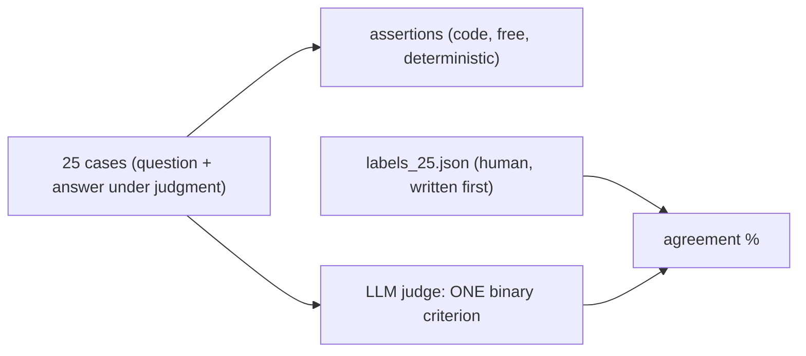

# Week 6: validate the judge before you trust its number

Brief: [`WEEKLY_RAG_TASK/W6-Task-Set-C.md`](../../../WEEKLY_RAG_TASK/W6-Task-Set-C.md).
How it fits the system: [`../../ARCHITECTURE.md`](../../ARCHITECTURE.md#3-week-6-can-you-trust-the-judge).

## What exists

| Requirement | Where |
| --- | --- |
| 25+ cases, each tagged with a Week-5 mode, >= 2 regression replays | `week6/eval_cases_25.json` (5 per mode; regression: `case_01`, `case_06`, `case_16`) |
| One command, pass rate by mode | `python week6/eval_week6.py` |
| Criteria moved from judge to deterministic assertions | `week6/assertions.py` (5 assertions; the count is computed from the code) |
| 25 blind hand labels saved **before** the judge ran | `week6/labels_25.json` (commit `a736e4b`, 2026-09-06 22:32; judge code/outputs arrive in `7ed17be`, 2026-09-07 00:01) |
| Judge v1 -> v2 using 2 of its own disagreements | `week6/judge_v1.txt`, `week6/judge_v2.txt` |
| Prediction filed before iterating | `week6/prediction.txt` |
| Disagreement analysis | [`disagreements.md`](disagreements.md) |
| Error analysis and fixes | [`ERROR_ANALYSIS_AND_FIXES.md`](ERROR_ANALYSIS_AND_FIXES.md), [`rag_findings.md`](rag_findings.md) |
| Importable questions | [`../../questions/week6_judge_eval_25_cases.txt`](../../questions/week6_judge_eval_25_cases.txt) |
| UI | **Judge Evaluator** and **Retrieval Benchmark** tabs (`/eval/judge`, `/eval/retrieval`) |

## How it runs

The judge only decides semantic correctness. Section present / resolves, version cited, a
numeric value, and the out-of-jurisdiction refusal are asserted in code; asking a model to
check whether `10.1` exists is paying for what an `if` does for free.

## Honest status (verified by reading the repository and re-running the tests)

**Solid**

- Blind protocol: the label file predates every judge artifact in git history.
- Assertion / judged split is implemented, and the reported count can no longer drift from the code.
- Judge runs fail closed: a provider error is an error, not a silent "0".
- The Week 6 lifecycle tests are now deterministic (previously polled for 2.5 s on a ~6 s run and leaked an active run into the next test).

**Not solid: do not quote these numbers**

- `agreement_before` / `agreement_after` are **not established**. The stored artifacts contradict each other:
  the saved run outputs say 68% -> 28%; `trace_eval_results.json` says 56% -> 100% but that is the
  *offline rule stand-in*, not a judge; `certified_final_eval_results.json` says 100% but combines LLM and
  rule verdicts; `live_llm_audit_results.json` has 14 errors. In the 68% run 7 of 8 "disagreements" were
  timeouts coerced to 0.
- The current `judge_v1.txt` / `judge_v2.txt` have been edited since the recorded runs and have never been
  measured on a complete run.
- The refusal and numeric criteria still appear in the judge prompts while also being assertions
  (the brief asks for them to be *removed* from the prompt).
- Both few-shot examples in v2 are cases from the scored set (so the judge has seen two answers it is scored on).
- **`case_16` label is disputed.** "What is the mandatory retirement age for permanent staff?" is labelled a
  correct refusal, but the handbook states it (Section 10.3: employment ends at the end of the month of the
  65th birthday). It was not relabelled: changing a label after seeing results breaks the blind protocol.
  Record it as a disagreement between the label and the document.
- `eval_week6.py` with `WEEK6_LIVE_LLM=0` uses a rule function in place of the judge; its output is a
  smoke test, not a judge measurement. The canned "Finding" text that asserted a cause was removed; the
  script now prints only the measured change.

**To finish Week 6 properly**

1. Freeze `judge_v1.txt` and `judge_v2.txt`; remove the assertable criteria from them.
2. File a fresh prediction in its own commit.
3. Run v1 and v2 live, fail-closed, over all 25 cases; report `agreement_before` and `agreement_after` once, with
   kappa (the labels are 23 ones and 2 zeros, so an "always 1" judge already scores 92%).
4. Take the v2 few-shot examples from genuine (non-timeout) disagreements and keep them out of the scored set.
5. Delete or regenerate `trace_eval_results.json` and `certified_final_eval_results.json`.

## Related fixes made in this pass

- Upload rollback: a failing manifest save inside the error handler no longer turns a clean indexing error into an HTTP 500.
- `ensure_frontend_built` returns `False` and logs instead of exiting the server; its four stale tests now assert that.
- Tests no longer write to the live application's state database, and never depend on a developer's `.env`.
